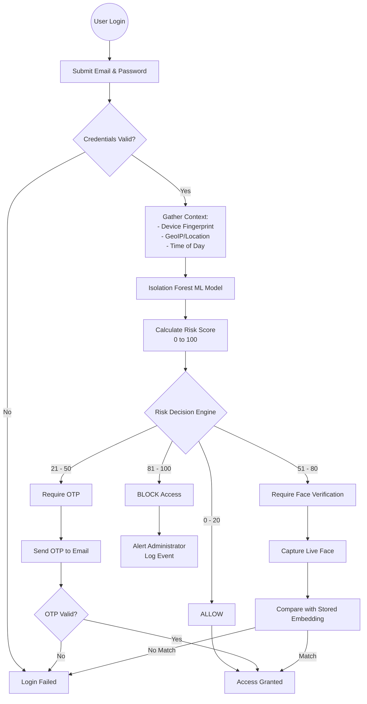
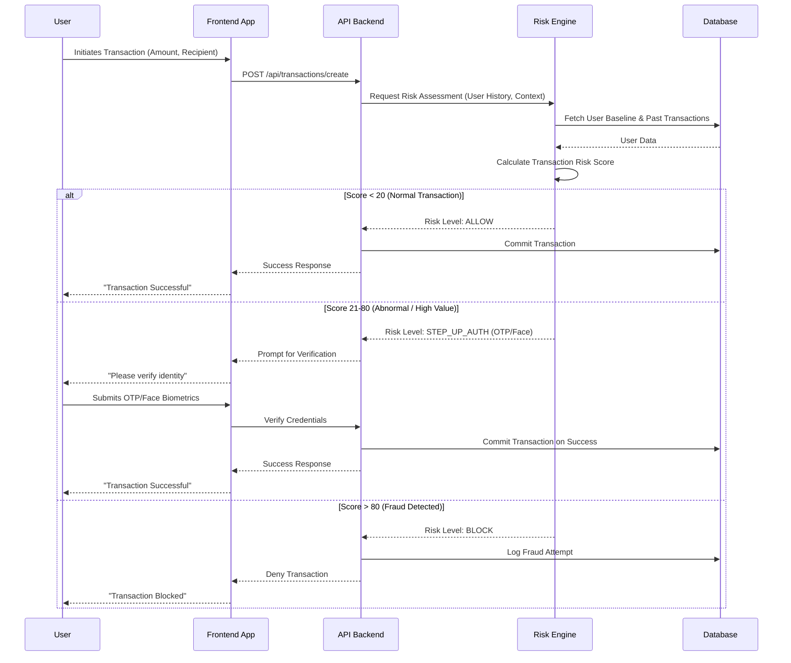
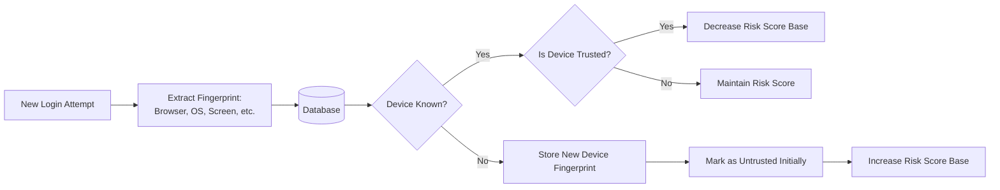

# TrustShield AI: Working Principles & System Flow

TrustShield AI is an Identity Trust Engine designed for the banking sector. It continuously evaluates user trust during critical operations such as login and transactions. By computing a real-time risk score (ranging from 0 to 100), the system dynamically determines the necessary level of authentication or blocks access entirely.

This document outlines the core working principles, risk scoring logic, and provides visual flow diagrams of the system's architecture.

---

## 1. Core Concepts

### Real-Time Risk Analysis
The heart of TrustShield AI is its hybrid risk scoring engine, utilizing an **Isolation Forest** Machine Learning model to detect anomalies. The risk engine takes multiple vectors into account:
- **Device Fingerprinting:** Identifies new or untrusted devices based on browser, OS, and hardware characteristics.
- **Location & GeoIP Tracking:** Detects impossible travel scenarios or access from blacklisted/unusual locations.
- **Behavioral Patterns:** Monitors transaction amounts, frequencies, and login timings compared to historical baselines.

### Dynamic Multi-Factor Authentication (MFA)
Authentication friction is dynamically adjusted based on the calculated risk score:
- **Low Risk:** Direct access.
- **Medium Risk:** Email OTP verification.
- **High Risk:** Live Face verification.
- **Critical Risk:** Immediate block.

---

## 2. Risk Decision Engine

The Risk Engine maps calculated risk scores to concrete actions. This ensures a balance between user experience and stringent security.

| Risk Score | Status | Action |
|------------|--------|--------|
| **0 - 20** | `ALLOW` | Direct access granted. Proceed seamlessly. |
| **21 - 50**| `OTP`   | Moderate risk. Email OTP verification required. |
| **51 - 80**| `FACE`  | High risk. Live Face Verification required. |
| **81 - 100**| `BLOCK`| Critical risk. Access denied, administrator alerted. |

---

## 3. System Flow Diagrams

### 3.1 Overall Authentication & Registration Flow

The following diagram illustrates the initial authentication flow, highlighting how risk scoring intercepts the login process.

### 3.2 Transaction Processing Flow

When a user initiates a transaction, the trust engine continuously monitors it, re-evaluating the risk based on the transaction's parameters.

### 3.3 Device Enrollment & Fingerprinting

Device fingerprints ensure that returning users from familiar devices experience lower friction.

---

## 4. Architectural Summary

TrustShield relies on a robust combination of FastAPI for quick backend decision-making and Next.js for a seamless frontend experience. The core of its security lies not just in standard credentials, but in the ambient data collected seamlessly from the user's interaction point. Every login and transaction is treated not as a discrete event, but as a continuation of a behavioral pattern analyzed continuously by the Isolation Forest ML model.
